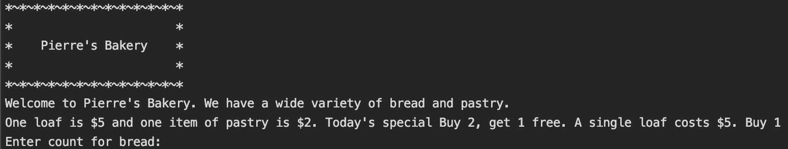

# Bakery

##***"Pierre's Bakery"***

A C# console application for a bakery.7/21/19. *By Maryana Antonyuk*

##Description

A program that prompts user to choose pastry and /or bread, offers to choose the amount of the items and calculate the total cost.
It also also implements the calculation of the "today's deal":
"Bread: Buy 2, get 1 free. A single loaf costs $5.
Pastry: Buy 1 for \$2 or 3 for $5."

##Setup/Installation 

###Requirements

To run this program, you have to have IDE, ex VisualStudio (I used Rider(JetBrainer)) or Terminal.

###For Terminal:

1. Clone this repository.

2. Open the command line--I use Terminal--type 'git clone' and repository link.
At this point its a console program. In order to check its functionality you have to be in the directory of the program. 
3. Use commands mcs program.name. cs; mono in the terminal.

You will have access to all files. Enjoy!
###Known Bugs
At this point it is a console application.
###Technologies Used
C#
.NET

####Support and contact details.

Email me with any questions, comments, or concerns.

**License**

This software is licensed under the MIT license.

Copyright (c) 2019 Maryana Antonyuk

